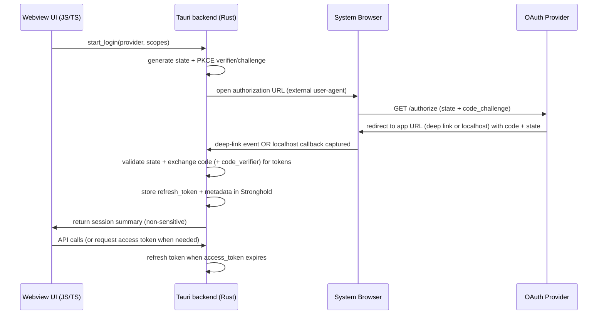

# Deep Research on Cross-Platform Libraries and Plugins for a Client-Only Tauri App

## Executive summary

A client-only Tauri application that relies on external APIs for its source of truth (here: MyAnimeList and Google Drive) lives or dies by four things: (1) secure, reliable token storage, (2) correct OAuth flows (Authorization Code + PKCE, refresh tokens, redirect handling), (3) a pragmatic approach to QR rendering + scanning across desktop and Android, and (4) minimizing your attack surface via Tauri’s permissions/capabilities model. citeturn27search17turn16search10turn15view0

The most “truly cross-platform” single secure-storage option that covers **Windows + Linux + Android** is **the official Stronghold plugin** (`@tauri-apps/plugin-stronghold` / `tauri-plugin-stronghold`), which supports **Windows, Linux, macOS, Android, iOS** and is designed specifically for secrets/key material. citeturn29view0turn34search0turn31search15 For OAuth, the most robust general-purpose approach (covering your minimum platforms) is a **composition**: **Deep Linking** (redirect capture) + **Opener** (launch external browser) + a standards-based OAuth implementation (Rust `oauth2` crate or JS `oauth4webapi`) + secure storage (Stronghold). citeturn15view0turn31search6turn12search13turn12search0turn34search1turn31search2turn34search0

For QR, there is no single solution that is simultaneously “native-best,” stable, and complete across **Windows/Linux/Android**. The best practical pairing is: **official `barcode-scanner` plugin on mobile** plus a browser-based scanner (e.g., **`@zxing/browser`**) for desktop (and optionally web). citeturn31search15turn33search4turn12search4turn12search12turn26search3

**Best overall recommendation (covers your minimum platforms well):**

- Secure storage: **Stronghold plugin**
- OAuth: **Deep Link + Opener + Rust `oauth2` (or JS `oauth4webapi`)**, store refresh tokens in Stronghold
- HTTP: **Tauri HTTP Client plugin** (avoid CORS issues; restrict allowed domains/endpoints using plugin scopes)
- QR: **Mobile: official Barcode Scanner plugin**; Desktop: **`@zxing/browser`**; Rendering: **`qrcode`** citeturn29view0turn15view0turn31search6turn28search21turn31search15turn12search4turn30search2

**Best fallback (when redirects/deep-linking are problematic for a provider on desktop):**

- Desktop OAuth redirect capture via **`tauri-plugin-oauth`** (localhost callback server), while still using Deep Link for mobile; keep Stronghold for storage. citeturn17view0turn15view0turn29view0

## Evaluation framework and constraints

### Platform target interpretation

Your “minimum” target is **Windows + Linux + Android**. macOS/iOS/Web are explicitly “nice-to-haves.” This report therefore prioritizes:

- **Libraries/plugins that explicitly list Windows, Linux, Android** support (or can be cleanly paired to cover those three).
- Tauri official plugins and primary package sources (Tauri docs, GitHub, docs.rs, crates.io, npm/JSR pages). citeturn31search15turn29view0turn15view0turn12search13turn32search11

### OAuth correctness constraints for Google

For Google Drive access, you must assume:

- **Authorization Code flow (with PKCE)** is the correct baseline for installed/native apps, and refresh tokens are expected for ongoing access. citeturn8search0turn8search2turn12search13
- Google prohibits OAuth flows in “embedded webviews”; you should use an **external user-agent** (system browser / custom tabs / similar), not a login page inside the Tauri webview. citeturn8search1turn8search13turn8search25

### Security model assumptions inside Tauri

Tauri’s security posture is heavily influenced by (a) strict trust boundaries between Rust backend and the webview frontend, and (b) capabilities/permissions that should be minimized per window/platform. citeturn27search17turn16search10turn15view0 Any plugin that exposes powerful primitives (filesystem, opener, arbitrary HTTP) should be scoped down to your exact needs. citeturn28search6turn31search10turn16search10

## Secure storage and key management options

### Candidate: `@tauri-apps/plugin-stronghold` / `tauri-plugin-stronghold`

**Language/runtime:** Rust core + JS guest bindings (official plugin). citeturn29view0turn31search15  
**Platforms (explicit):** Windows ✅; Linux ✅; Android ✅; macOS ✅; iOS ✅; Web ❌. citeturn29view0  
**License:** MIT OR Apache-2.0 (package metadata and official plugin ecosystem are dual-licensed). citeturn34search0turn27search15  
**Maturity/stability:** Official plugins are centralized in `tauri-apps/plugins-workspace` (≈1.6k GitHub stars overall), and the Stronghold npm package shows weekly usage and active publishing. citeturn34search0turn27search15

- **Weekly downloads:** ~2,073/week (npm package). citeturn34search0
- **Maintenance signals:** Tauri’s Stronghold plugin docs were updated Dec 9, 2025 (indicates continued maintenance and documentation refresh). citeturn29view0

**Integration notes with Tauri:**  
Stronghold is designed as a secrets/key store. It must be initialized with a password hashing function that produces a 32-byte hash; Tauri provides an Argon2 helper, or you can supply your own. citeturn27search24turn29view0 From the JavaScript-side API reference, the vault is structured for secure secret storage and does not provide trivial “read the plaintext back” semantics without procedures (a deliberate design choice that helps reduce accidental exfiltration to the frontend). citeturn28search19turn34search23

**Security considerations:**

- You still must handle **unlocking UX and key derivation** correctly. Stronghold’s security depends on the secrecy of the derived key material (from password or equivalent). citeturn27search24turn29view0
- Avoid putting refresh tokens into the webview’s localStorage/IndexedDB unless you accept a materially larger XSS/exfiltration risk compared with storing them behind the Rust boundary. Tauri’s security model explicitly frames the trust boundary between Rust and frontend code. citeturn27search17

**Limitations / caveats:**

- Not “platform-native keystore” (e.g., not Windows Credential Manager / Android Keystore). It is a cross-platform secure vault. citeturn29view0turn27search24
- You need a strategy for **unlocking** (password prompt, device biometric-gated key retrieval, etc.). citeturn27search24turn31search7

**Recommended alternatives:**

- If you strongly prefer platform-native stores and can accept platform branching, combine desktop keyrings + mobile keystore (see keystore/keyring plugins below). citeturn27search18turn27search6
- If you only need persistence for non-secrets, use the Store plugin (but not for refresh tokens). citeturn29view1turn7search12

### Candidate: `@tauri-apps/plugin-store` / `tauri-plugin-store`

**Language/runtime:** Rust + JS guest bindings (official plugin). citeturn29view1turn31search15  
**Platforms (explicit):** Windows ✅; Linux ✅; Android ✅; macOS ✅; iOS ✅; Web ❌. citeturn29view1  
**License:** MIT OR Apache-2.0 (npm package metadata). citeturn31search1  
**Maturity/stability:**

- **Weekly downloads:** ~57,718/week. citeturn31search1
- Official plugin ecosystem has high adoption (plugins-workspace ≈1.6k stars). citeturn27search15

**Integration notes with Tauri:**  
Plugin Store is a persistent key–value store backed by a file in the app’s data/cache directories (asynchronous save/load). citeturn29view1

**Security considerations:**

- Treat Plugin Store as **not a secrets vault** unless you add encryption plus careful key management. The older Store API documentation explicitly describes storing **unencrypted values** (which captures the general risk of “file-backed store ≠ secure store”). citeturn7search12turn29view1
- Good use cases: UI preferences, non-sensitive cached state, last-sync timestamps, feature flags. citeturn29view1

**Limitations / caveats:**

- A persistent store does not automatically imply OS-backed encryption or biometric gating. citeturn29view1turn7search12

**Recommended alternatives:**

- For tokens/refresh tokens: Stronghold. citeturn29view0
- For OS keychain style storage: keyring/secure-storage plugins below (desktop-focused), or mobile keystore on Android/iOS. citeturn27search18turn27search6

### Candidate: `tauri-plugin-secure-storage` (system keyring-backed)

**Language/runtime:** Rust plugin (with optional JS interface depending on packaging). citeturn27search0turn34search22  
**Platforms (explicit):** Windows: likely ✅; Linux: likely ✅; Android: unclear/likely ❌; macOS: likely ✅; iOS: unclear; Web: ❌.  
The crate description is “secure storage using the system’s keyring”; however, the accessible sources here do not provide an authoritative platform matrix for Android. citeturn27search0turn34search6turn34search22

**License:** Not fully confirmed from the accessible excerpts (requires checking the repo/license files directly). citeturn27search0turn34search6  
**Maturity/stability:**

- Versioned crate on crates.io with multiple published versions and recent updates in 2025 (suggests active development). citeturn27search0turn34search10
- Maintainer metadata is visible via lib.rs summaries, but direct download/star metrics could not be fully validated from the accessible excerpts. citeturn34search14turn34search6

**Integration notes with Tauri:**  
This class of plugin is appropriate for storing a **Stronghold-derived master key**, refresh tokens, or encryption keys in the OS credential store (on platforms where available), reducing the need for user-entered passwords each launch. citeturn27search18turn27search0

**Security considerations:**

- OS keyrings typically provide better “platform-native” user expectations (unlock, device login integration), but the security properties vary widely by OS and configuration (e.g., Linux Secret Service availability). citeturn27search0turn27search17

**Limitations / caveats:**

- Android support is the main uncertainty; if Android keystore support is required, you likely need a separate Android-specific plugin (see `tauri-plugin-keystore`). citeturn27search6

**Recommended alternatives:**

- Cross-platform uniform: Stronghold. citeturn29view0
- Explicit Android+iOS keystore: `tauri-plugin-keystore`. citeturn27search6
- Desktop keyring wrapper: `tauri-plugin-keyring`. citeturn27search18

### Candidate: `tauri-plugin-keyring` (wrapper over Rust `keyring`)

**Language/runtime:** Rust plugin + JS API package (`tauri-plugin-keyring-api`). citeturn27search18turn7search14  
**Platforms (explicit):** Windows ✅; Linux ✅; Android: not stated; macOS ✅; iOS: not stated; Web ❌. (This plugin is explicitly positioned as “system keychain” storage; Android support is not claimed in the accessible sources.) citeturn27search18turn7search14  
**License:** Not confirmed from the retrieved excerpt (requires repo license review). citeturn27search18turn7search14  
**Maturity/stability:**

- GitHub stars are not reliably visible in the excerpts, but the project is straightforward and referenced as a practical helper to store Stronghold encryption keys in the system keychain. citeturn27search18turn7search14

**Integration notes with Tauri:**  
The repository explicitly positions keyring as a place to store Stronghold-related encryption keys “without prompting user for password every time.” citeturn27search18 That is a useful pattern for Desktop: **Stronghold for encrypted vault + Keyring to store the vault unlock key**. citeturn27search18turn29view0

**Security considerations:**

- Great for desktop token storage, but verify Linux behavior (Secret Service presence, headless sessions, etc.). citeturn27search18turn27search17

**Limitations / caveats:**

- No explicit Android support claim; assume you need a separate mobile keystore plugin if Android is a hard requirement. citeturn27search18turn27search6

**Recommended alternatives:**

- Stronghold-only (uniform, cross-platform). citeturn29view0
- Android/iOS-only keystore plugin. citeturn27search6

### Candidate: `tauri-plugin-keystore` (Android Keystore + iOS Keychain)

**Language/runtime:** Tauri plugin with native mobile implementations + JS bindings. citeturn27search6turn7search0  
**Platforms (explicit):** Windows ❌; Linux ❌; Android ✅; macOS ❌; iOS ✅; Web ❌. citeturn7search0turn27search6  
**License:** Apache-2.0 (repo states Apache-2.0 license). citeturn7search0  
**Maturity/stability:**

- Very low GitHub star count (~3), tagged “alpha,” so treat as early-stage. citeturn7search0
- Still, it provides a very targeted primitive: store/retrieve/remove a secret gated by device biometric configuration. citeturn7search0

**Integration notes with Tauri:**  
The README recommends checking the official biometric plugin before using it, because calls fail if no biometrics are set up. citeturn7search0turn4view0

**Security considerations:**

- Biometric-gated storage is a strong UX/security combination for mobile, but be precise about fallback rules and threat model (biometric vs device passcode). citeturn7search0turn4view0

**Limitations / caveats:**

- **Does not satisfy your minimum Windows/Linux/Android requirement by itself** (mobile-only). citeturn7search0

**Recommended alternatives:**

- For “one solution across Windows/Linux/Android”: Stronghold. citeturn29view0
- For platform-native hardware-backed keys (not Linux): secure-element plugin. citeturn27search10

### Candidate: `tauri-plugin-secure-element` (TPM / Secure Enclave / StrongBox)

**Language/runtime:** Tauri plugin with native integrations. citeturn27search10turn27search12  
**Platforms (explicit):** Windows ✅; Linux ❌; Android ✅; macOS ✅; iOS ✅; Web ❌. citeturn27search10turn27search12  
**License:** Apache-2.0. citeturn27search10  
**Maturity/stability:**

- Substantial commit history (226 commits) and detailed platform limitation documentation. citeturn27search10
- However, it does **not** cover Linux, so it can’t be the sole solution for your minimum platform requirement. citeturn27search10

**Integration notes with Tauri:**  
Best used when you want to generate keys inside hardware-backed secure elements and perform signing without ever exporting the private key. This can be valuable for higher-assurance local cryptography (e.g., signing a device key used to encrypt Stronghold unlock material). citeturn27search10

**Security considerations:**

- Hardware-backed keys reduce key extraction risk, but do not eliminate malware risk on compromised devices. citeturn27search10turn27search17

**Limitations / caveats:**

- Linux unsupported; macOS Secure Enclave development requires special code signing and is not trivial. citeturn27search10

**Recommended alternatives:**

- For Linux compatibility: Stronghold (and optionally desktop keyring). citeturn29view0turn27search18

## OAuth handling options

### Ground truth: use external user-agents for Google OAuth

Google explicitly blocks OAuth requests in embedded WebViews and recommends using secure browser alternatives. For a Tauri app, that means: **do not run Google’s login inside the Tauri webview**; use OS browser / custom tabs style flows. citeturn8search1turn8search13turn8search25

### Candidate: Rust `oauth2` crate (RFC 6749 + PKCE + refresh)

**Language/runtime:** Rust library (backend-side). citeturn12search13turn12search10  
**Platforms (explicit):** Windows ✅; Linux ✅; Android ✅; macOS ✅; iOS ✅; Web ❌ (as a Rust crate, it runs where Rust runs; Tauri backend targets desktop/mobile). citeturn12search13turn28search21turn29view0  
**License:** Not confirmed in retrieved excerpts (commonly dual/permissive; verify in repo before final selection). citeturn12search2turn12search10  
**Maturity/stability:**

- Very high crates.io adoption; one version page lists **~13M+ downloads** and many published versions. citeturn12search10turn12search2
- Documentation explicitly recommends PKCE for clients that cannot keep secrets (native/mobile/client-side). citeturn12search13

**Integration notes with Tauri:**  
Use `oauth2` in Rust commands/services that:

1. generate `state` + PKCE verifier/challenge,
2. build the auth URL,
3. open it via Opener,
4. receive redirect via Deep Link (mobile + desktop) or localhost callback (desktop fallback),
5. exchange `code` for tokens,
6. store tokens in Stronghold. citeturn12search13turn15view0turn31search6turn17view0turn29view0

**Security considerations:**

- Always validate `state` and bind PKCE verifier to the initiation attempt; do not log auth codes or refresh tokens. citeturn12search13turn27search17
- Prefer `S256` PKCE over `plain` when provider supports it (general best practice; verify provider requirements). citeturn12search13turn8search25

**Limitations / caveats:**

- You still need a redirect capture mechanism (Deep Link or localhost). The crate does not solve OS-integrated redirect handling. citeturn15view0turn17view0

**Recommended alternatives:**

- JS-side OAuth via `oauth4webapi` when you want to keep most logic in the frontend but still avoid storing tokens insecurely. citeturn12search0turn32search11

### Candidate: JS `oauth4webapi` (panva) + optional JSR distribution

**Language/runtime:** JavaScript (browser and non-browser runtimes). citeturn12search0turn12search7  
**Platforms (explicit):** Windows ✅; Linux ✅; Android ✅; macOS ✅; iOS ✅; Web ✅ (because it targets JS runtimes and Web Platform APIs). citeturn12search0turn12search7  
**License:** MIT (JSR listing for `@panva/oauth4webapi`). citeturn32search11  
**Maturity/stability:**

- Explicit feature scope includes **Authorization Code w/ PKCE** and **Refresh Token** and advanced best-practice mechanisms. citeturn12search0turn12search3
- JSR distribution shows ongoing releases (published within days) and weekly download stats (hundreds to low-thousands/week depending on view). citeturn32search11turn32search22
- Note: an older scoped npm package listing exists and appears stale; prefer the actively maintained distribution channel used by the project (JSR) if that aligns with your tooling. citeturn32search3turn32search11

**Integration notes with Tauri:**  
If you keep OAuth logic in the frontend, you still need to:

- start auth by opening the system browser (Opener),
- capture redirect (Deep Link),
- then call token endpoint (either via fetch if CORS permits, or via Tauri HTTP plugin to bypass CORS). citeturn31search6turn15view0turn29view2turn28search6

**Security considerations:**

- If tokens are processed in the webview, your main risk is **frontend compromise (XSS)** leading to token exfiltration. Minimize exposure by moving token exchange + storage behind Rust whenever possible. citeturn27search17turn29view0

**Limitations / caveats:**

- Provider-specific quirks still exist; for example, desktop Google OAuth often uses loopback redirect URIs, which is easier with a localhost server plugin. citeturn8search2turn17view0turn18view0

**Recommended alternatives:**

- Rust `oauth2` for backend-side control and reduced token exposure to frontend. citeturn12search13turn27search17

### Candidate: `@tauri-apps/plugin-deep-link` / `tauri-plugin-deep-link`

**Language/runtime:** Official Tauri plugin (Rust + JS bindings). citeturn15view0turn28search7turn31search15  
**Platforms (explicit):** Windows ✅; Linux ✅; Android ✅; macOS ✅; iOS ✅; Web ❌. citeturn15view0  
**License:** MIT OR Apache-2.0; weekly npm downloads are visible. citeturn34search1  
**Maturity/stability:**

- **Weekly downloads:** ~53,525/week. citeturn34search1
- Documented integration with Single Instance for desktop deep-link delivery. citeturn15view0turn28search1

**Integration notes with Tauri:**

- On **Linux and Windows**, deep links are delivered to a new app process as CLI args; Tauri provides integration with the **Single Instance** plugin so a single running instance receives the event. citeturn15view0turn28search1
- The plugin provides `getCurrent()` for “did the app start from a deep link?” and `onOpenUrl()` for listening to new URLs. citeturn15view0turn34search18
- On **macOS/Android/iOS**, deep links must be configured statically (dynamic runtime registration is not supported). citeturn15view0

**Security considerations:**

- Tauri explicitly cautions that users can trigger “fake” deep links on Windows/Linux by passing arguments; you should validate the format and enforce strict parsing. citeturn15view0

**Limitations / caveats:**

- Verified HTTPS App Links / Universal Links require hosting `.well-known` association files; custom schemes are simpler but not always accepted as OAuth redirect URIs by every provider. citeturn15view0turn17view0

**Recommended alternatives:**

- Desktop-only workaround for providers that disallow custom schemes: use a localhost-callback plugin (`tauri-plugin-oauth`). citeturn17view0

### Candidate: `@tauri-apps/plugin-opener` / `tauri-plugin-opener`

**Language/runtime:** Official Tauri plugin. citeturn31search6turn31search10turn27search15  
**Platforms (explicit):** Windows ✅; Linux ✅; Android ✅; macOS ✅; iOS ✅; Web ❌. citeturn31search6turn13view1  
**License:** MIT OR Apache-2.0; high weekly usage. citeturn31search2turn27search15  
**Maturity/stability:**

- **Weekly downloads:** ~144,472/week. citeturn31search2

**Integration notes with Tauri:**  
Opener is the simplest “launch external browser/file handler” primitive. It also has a scope model to restrict what can be opened (reduce phishing/open-redirect style risks). citeturn31search10turn16search10  
For mobile, the Rust code indicates it always uses the platform default program for opening URLs (i.e., does not rely on arbitrary “open with”). citeturn13view1

**Security considerations:**

- Use Opener scopes to only allow redirect/authorization endpoints you actually need. citeturn31search10turn16search10

**Limitations / caveats:**

- You still need redirect capture (Deep Link or localhost server). citeturn15view0turn17view0

**Recommended alternatives:**

- If you need more in-app control over auth tabs on mobile, consider provider-specific mobile auth mechanisms (e.g., `tauri-plugin-web-auth` for Custom Tabs/ASWebAuthenticationSession on mobile-only). citeturn22search12

### Candidate: `tauri-plugin-oauth` (desktop localhost redirect capture)

**Language/runtime:** Rust plugin + optional JS API. citeturn17view0turn16search5  
**Platforms (explicit):** Desktop-focused (Windows ✅; Linux ✅; macOS ✅); Android ❌; iOS ❌; Web ❌. citeturn17view0  
**License:** MIT OR Apache-2.0 (dual). citeturn17view0turn16search1  
**Maturity/stability:**

- ~200 GitHub stars; latest release Nov 5, 2024 (as shown on repo page). citeturn17view0

**Integration notes with Tauri:**  
The plugin spawns a temporary localhost server to capture the OAuth redirect and then forwards the URL back to the app (via events/callbacks). It is explicitly motivated by providers that disallow custom URI schemes as redirect URLs. citeturn17view0turn16search4

**Security considerations:**  
The README explicitly warns that because the localhost port is unprotected, you must validate the received URL and ideally only emit minimal data back to the frontend. citeturn17view0

**Limitations / caveats:**

- Desktop-only; you still need a different approach on Android. citeturn17view0turn15view0

**Recommended alternatives:**

- Deep Link plugin for cross-platform redirect capture. citeturn15view0

### Candidate: `tauri-plugin-google-auth` (Google-specific)

**Language/runtime:** Rust plugin + JS API; includes native modules (Kotlin/Swift) for mobile flows. citeturn18view0turn16search6  
**Platforms (explicit):** iOS ✅; Android ✅; macOS ✅; Windows ✅; Linux ✅; Web ❌. citeturn18view0  
**License:** MIT. citeturn18view0  
**Maturity/stability:**

- Low stars (~8), but substantial commit history and dedicated mobile setup docs (suggests active work albeit small community footprint). citeturn18view0

**Integration notes with Tauri:**

- “Mobile Support” is implemented using platform APIs; “Desktop Support” uses OAuth2 flow with local redirect server; includes refresh/revoke functionality. citeturn18view0
- You still need to store refresh tokens securely (Stronghold or OS keyring). citeturn18view0turn29view0

**Security considerations:**

- Keep Google’s embedded webview restrictions in mind; this plugin claims to use proper flows (native SDK on mobile; browser+local server on desktop). citeturn18view0turn8search1turn8search2

**Limitations / caveats:**

- It is Google-specific; you still need a generic OAuth approach for MyAnimeList. citeturn18view0turn9search5

**Recommended alternatives:**

- Generic: Rust `oauth2` crate + Deep Link + Opener. citeturn12search13turn15view0turn31search6

### Provider notes: MyAnimeList vs Google Drive

**Google Drive:** Google’s OAuth documentation emphasizes OAuth 2.0 for installed apps and refresh token usage (token refresh is a first-class concept). citeturn8search0turn8search2  
**MyAnimeList:** The official docs were not directly accessible in this environment (site access errors), but multiple independent implementations and client libraries reference the OAuth endpoints and show that MyAnimeList uses OAuth2 with access/refresh tokens and a token endpoint at `myanimelist.net/v1/oauth2/token`. citeturn10view0turn9search5turn11search1

## QR code rendering and scanning options

### Candidate: `@tauri-apps/plugin-barcode-scanner` / `tauri-plugin-barcode-scanner`

**Language/runtime:** Official Tauri plugin with native mobile camera integration + JS bindings. citeturn31search15turn33search4turn34search9  
**Platforms (explicit):**

- Windows ❌; Linux ❌; macOS ❌; Android ✅; iOS ✅; Web ❌ (npm indicates desktop is unsupported; official plugin table reports mobile-only status). citeturn30search0turn31search15turn33search4  
  **License:** Official plugin ecosystem is dual-licensed; package-license specifics are not fully visible in retrieved excerpts for this package. citeturn27search15turn33search0  
  **Maturity/stability:**
- Latest npm version listed (2.4.2, published ~2 months prior in the excerpt). citeturn33search0
- As an official plugin, it benefits from the overall plugins-workspace maintenance base (~1.6k stars). citeturn27search15turn34search16

**Integration notes with Tauri:**  
This is the best “native-feeling” scan UX on mobile because it uses the camera through native integration rather than through webview WebRTC support. citeturn34search9turn33search4  
The JS reference indicates format-level caveats (some formats not supported on Android; some require iOS 15.4+). citeturn33search4turn34search13

**Security considerations:**

- Camera permissions must be requested and handled cleanly; avoid leaving the camera active longer than needed. citeturn33search4

**Limitations / caveats:**

- **Does not cover Windows/Linux**, so you need a desktop scanning fallback. citeturn30search0turn31search15

**Recommended alternatives:**

- Desktop scanning in the webview using `@zxing/browser`. citeturn12search4turn12search12
- If you only need decode-from-image (no camera UI), `jsQR` can be used with your own frame acquisition. citeturn26search15

### Candidate: `@zxing/browser` (ZXing JS browser layer)

**Language/runtime:** TypeScript/JavaScript library (runs in browsers/webviews). citeturn12search4turn26search7  
**Platforms (explicit):** Windows ✅; Linux ✅; Android ✅; macOS ✅; iOS ✅; Web ✅ (in practice, it depends on `getUserMedia` availability and camera permissions in the runtime). citeturn12search4turn26search7  
**License:** MIT (GitHub org listing shows MIT for `zxing-js/browser`). citeturn12search16turn12search12  
**Maturity/stability:**

- GitHub: ~269 stars for `zxing-js/browser`, and it is a wrapper over the more widely used core library. citeturn12search12turn12search16
- It supports scanning from `<video>` and handling webcam use for scanning. citeturn12search4

**Integration notes with Tauri:**

- Works well as a desktop scanning fallback (Windows WebView2 / macOS WKWebView / Linux WebKitGTK). Practical friction will mostly be camera permissions/availability in the embedded webview environment. citeturn12search4turn16search23

**Security considerations:**

- Ensure you request camera access only in the context of an explicit user gesture and do not keep camera streams open across navigation. (Implementation detail; threat model is similar to web apps.) citeturn12search4turn27search17

**Limitations / caveats:**

- Performance and scanning reliability vary depending on camera quality and runtime.
- For mobile, the native plugin often gives a smoother UX than a web camera view. citeturn34search9turn12search4

**Recommended alternatives:**

- `zxing-wasm` for a WASM-based decoder across JS runtimes (often heavier but can be flexible). citeturn28search16turn26search19
- `jsQR` for “decode-only” use cases. citeturn26search15

### Candidate: `jsQR` (decode-only)

**Language/runtime:** JavaScript. citeturn26search15  
**Platforms (explicit):** Windows ✅; Linux ✅; Android ✅; macOS ✅; iOS ✅; Web ✅ (decode only). citeturn26search15  
**License:** Apache-2.0 (as stated in the referenced write-up). citeturn26search15  
**Maturity/stability:**  
The key point is architectural: it’s a decoder; you must provide camera capture and frame extraction yourself. citeturn26search15

**Integration notes with Tauri:**  
Use when you want maximum control and minimal dependencies, and you are comfortable implementing the camera pipeline (or when you already have frames from another source). citeturn26search15

**Recommended alternatives:**

- `@zxing/browser` when you want both camera management and decoding. citeturn12search4

### Candidate: `qrcode` (rendering)

**Language/runtime:** JavaScript library (Node + browser). citeturn30search2  
**Platforms (explicit):** Windows ✅; Linux ✅; Android ✅; macOS ✅; iOS ✅; Web ✅. citeturn30search2  
**License:** MIT. citeturn30search2  
**Maturity/stability:**

- Very widely used: ~4,037,989 weekly downloads reported. citeturn30search2

**Integration notes with Tauri:**  
Render QR codes in your frontend as SVG/canvas/data URLs. This is typically sufficient for encoding OAuth device codes, sharing deep-link URLs, or exporting small payloads. citeturn30search2

**Security considerations:**

- QR rendering itself is low-risk, but be careful about encoding sensitive tokens directly (QR codes are trivially exfiltrated by shoulder-surfing/screenshots). citeturn27search17

**Recommended alternatives:**

- Framework wrappers (React/Vue components) can be used if you want convenience, but the core `qrcode` library is usually enough. citeturn30search2turn30search5

## Comparison and recommendations

### Summary table of top options by category

| Category                     | Top option                           | Language/runtime   | Platforms (Win / Linux / Android / macOS / iOS / Web) | License                          | Maturity signals (from primary sources)                                                                                         | Key caveats                                                                                             | Strong alternatives                                                                 |
| ---------------------------- | ------------------------------------ | ------------------ | ----------------------------------------------------- | -------------------------------- | ------------------------------------------------------------------------------------------------------------------------------- | ------------------------------------------------------------------------------------------------------- | ----------------------------------------------------------------------------------- |
| Secure storage (secrets)     | `@tauri-apps/plugin-stronghold`      | Rust + JS bindings | ✅ / ✅ / ✅ / ✅ / ✅ / ❌                           | MIT OR Apache-2.0                | Official plugin; ~2,073 weekly npm downloads; official plugins repo ~1.6k stars citeturn34search0turn27search15turn29view0 | Needs unlock/key derivation strategy; not OS keystore citeturn27search24turn29view0                 | Desktop keyring + mobile keystore (conditional) citeturn27search18turn27search6 |
| Secure storage (non-secrets) | `@tauri-apps/plugin-store`           | Rust + JS bindings | ✅ / ✅ / ✅ / ✅ / ✅ / ❌                           | MIT OR Apache-2.0                | ~57,718 weekly downloads citeturn31search1turn29view1                                                                       | File-backed; treat as unencrypted for secrets citeturn7search12turn29view1                          | Stronghold for secrets citeturn29view0                                           |
| OAuth core logic             | Rust `oauth2` crate                  | Rust               | ✅ / ✅ / ✅ / ✅ / ✅ / ❌                           | (verify)                         | ~13M+ downloads; PKCE guidance in docs citeturn12search10turn12search13                                                     | You must implement redirect capture + browser launch citeturn15view0turn31search6                   | JS `oauth4webapi` citeturn12search0turn32search11                               |
| OAuth redirect capture       | `@tauri-apps/plugin-deep-link`       | Rust + JS bindings | ✅ / ✅ / ✅ / ✅ / ✅ / ❌                           | MIT OR Apache-2.0                | ~53,525 weekly downloads; official plugin docs incl. security cautions citeturn34search1turn15view0                         | Windows/Linux deliver via CLI args → single-instance integration advised citeturn15view0             | Desktop localhost redirect via `tauri-plugin-oauth` citeturn17view0              |
| OAuth browser launch         | `@tauri-apps/plugin-opener`          | Rust + JS bindings | ✅ / ✅ / ✅ / ✅ / ✅ / ❌                           | MIT OR Apache-2.0                | ~144,472 weekly downloads; has open scopes model citeturn31search2turn31search10                                            | Scope carefully; still need redirect capture citeturn31search10turn15view0                          | Shell plugin or native solutions (case-by-case) citeturn31search6                |
| QR scanning (mobile)         | `@tauri-apps/plugin-barcode-scanner` | Native mobile + JS | ❌ / ❌ / ✅ / ❌ / ✅ / ❌                           | (official dual licensing likely) | Official plugin; mobile-only per official list; format caveats documented citeturn31search15turn33search4turn33search0     | Not for desktop; some formats not supported depending on OS version citeturn33search4turn34search13 | Desktop scanning via `@zxing/browser` citeturn12search4                          |
| QR scanning (desktop/web)    | `@zxing/browser`                     | JS/TS              | ✅ / ✅ / ✅ / ✅ / ✅ / ✅                           | MIT                              | ~269 GitHub stars; browser-scanning support described citeturn12search12turn12search4turn12search16                        | Depends on camera/WebRTC support in runtime citeturn12search4                                        | `jsQR` (decode-only), `zxing-wasm` citeturn26search15turn28search16             |
| QR rendering                 | `qrcode`                             | JS                 | ✅ / ✅ / ✅ / ✅ / ✅ / ✅                           | MIT                              | ~4,037,989 weekly downloads citeturn30search2                                                                                | Don’t encode sensitive tokens into displayable QR citeturn27search17                                 | Framework components wrapping `qrcode` citeturn30search5                         |

### Recommended architecture for OAuth + secure storage

This design keeps refresh tokens and long-lived secrets behind the Rust boundary and uses external user-agents, matching Google’s security constraints. citeturn8search1turn8search25turn27search17turn29view0

### Best overall recommendation

**Best overall (highest confidence for Windows + Linux + Android):**

1. **Secure storage:** Use **Stronghold** for refresh tokens, derived session keys, and any encryption key material that must persist (covers Windows/Linux/Android). citeturn29view0turn34search0
2. **OAuth core:** Implement generic OAuth in **Rust using `oauth2`** (PKCE + refresh), because it keeps token exchange code in the backend and reduces the chance of frontend exfiltration. citeturn12search13turn12search10turn27search17
3. **OAuth browser + callback:** Use **Opener** to launch the system browser and **Deep Link** to capture redirects. Add **Single Instance + deep-link integration** for Windows/Linux reliability. citeturn31search2turn15view0turn28search1
4. **API access:** Use the official **HTTP Client plugin** for API calls when you hit CORS restrictions; lock it down with allow/deny URL scopes so your app cannot become an arbitrary HTTP proxy. citeturn29view2turn28search6turn28search21
5. **QR:**
    - Rendering: `qrcode` for fast and ubiquitous QR generation. citeturn30search2
    - Scanning: mobile uses `@tauri-apps/plugin-barcode-scanner`; desktop uses `@zxing/browser`. citeturn31search15turn12search4turn30search0

**Why this is best overall:** it is the cleanest way to satisfy **your minimum platform requirement** with the fewest “unknown support” gaps, and it aligns strongly with Tauri’s security model (keep secrets behind backend + scoped permissions). citeturn29view0turn15view0turn27search17turn16search10

### Best fallback recommendation

**Best fallback (when provider redirect rules block custom schemes on desktop, or deep-linking is unreliable on a target OS):**

- Keep the same core (Stronghold + Rust `oauth2`), but on **desktop** capture authorization codes using **`tauri-plugin-oauth`** (loopback localhost server), while still using Deep Link on mobile. citeturn17view0turn29view0turn15view0

**Rationale:** `tauri-plugin-oauth` is explicitly designed to solve “provider doesn’t allow custom URI scheme redirects” by using localhost callbacks, but it introduces a small local attack surface. The plugin’s own guidance stresses validating the received URL because the port is unprotected. citeturn17view0turn8search25

### Practical, high-impact security hardening checklist

- **Avoid embedded webview OAuth logins for Google**; use external user-agents. citeturn8search1turn8search13turn8search25
- Use Tauri **capabilities** to restrict powerful plugin operations by window/platform; do not ship with overly broad permissions. citeturn16search10turn27search17
- Configure **HTTP plugin URL allowlists/denylists** to only the domains you need (Google + MyAnimeList endpoints) and avoid becoming a general-purpose request proxy. citeturn28search6turn29view2
- Treat **refresh tokens** as the primary secret; store them in Stronghold (or OS keystore), and do not encode them in QR codes or log output. citeturn29view0turn27search17
- If you use **deep links**, validate payload structure (scheme, host/path, expected parameters) and verify `state`. citeturn15view0turn12search13
- If you use **localhost callback** flows, bind to loopback only, use random ports, and validate the returned URL and parameters strictly. citeturn17view0turn6view2
